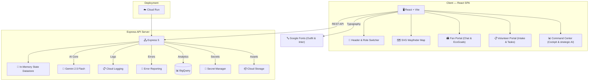

# 🏟️ StadiaIQ — Smart Stadium & Tournament Operations Platform

> **Challenge 4**: Build a GenAI-enabled solution that enhances stadium operations and the overall tournament experience for fans, organizers, volunteers, or venue staff during the **FIFA World Cup 2026**.

[](https://cloud.google.com)
[](https://ai.google.dev)
[](https://github.com/Hmpunith/stadia-iq/actions/workflows/ci.yml)
[](https://github.com/Hmpunith/stadia-iq/actions/workflows/codeql.yml)
[]()
[]()

StadiaIQ is a GenAI-enabled stadium operations and fan experience platform designed for the FIFA World Cup 2026. It features role-switching modules for **Fans**, **Venue Staff/Volunteers**, and **Tournament Organizers**, showcasing how Generative AI can improve navigation, crowd density management, multi-lingual reporting, accessibility, sustainability, and real-time operational decision support.

## 🏆 Chosen Vertical

**Smart Stadiums & Tournament Operations** — FIFA World Cup 2026 at MetLife Stadium (East Rutherford, NJ). The platform serves three distinct personas through a single unified interface:

- **Fans** — multilingual matchday assistant for navigation, accessibility, transport, sustainability tracking, and venue questions.
- **Volunteers / Venue Staff** — incident reporting console with AI-powered translation, severity classification, and task management.
- **Tournament Organizers** — operations command center with live crowd intelligence, incident monitoring, and AI-generated strategic briefings.

---

## 🎯 Problem Statement Alignment

| Challenge Requirement | StadiaIQ Feature | Implementation |
|---|---|---|
| **Wayfinding & Navigation** | 🗺️ Congestion-Aware Wayfinder | `WayfinderMap.jsx` & `/api/wayfind` — calculates optimal routes (SVG mapping) that dynamically avoid congested gates based on live crowd telemetry. |
| **Crowd Management** | 📊 Live Crowd Density Dashboard | `AdminPortal.jsx` & `/api/telemetry` — per-gate occupancy heatmap with comfortable/busy/critical thresholds computed deterministically; AI briefing recommends crowd redirections. |
| **Accessibility** | ♿ WCAG AA Compliant Interface | Dark/light theme toggle, keyboard navigation, skip links, `aria-live` route announcements, semantic HTML landmarks, and screen-reader-friendly components throughout. |
| **Transportation** | 🚌 Transit & Parking Guidance | `FanPortal.jsx` & `/api/chat` — Matchday Copilot answers transit questions (NJ Transit rail, bus shuttles, rideshare zones, parking lots) grounded on MetLife Stadium transport data. |
| **Sustainability** | 🌿 EcoGoal Matchday Tracker | `FanPortal.jsx` & `/api/sustainability` — fans log ecological actions (public transit, cup recycling, water refills) to earn points and compute carbon offsets. |
| **Multilingual Assistance** | 💬 Matchday Copilot | `FanPortal.jsx` & `/api/chat` — conversational chatbot assists fans with schedules, transit, and bag policies in any major language via Gemini multi-turn chat. |
| **Operational Intelligence** | 🚨 AI Incident Intake Console | `StaffPortal.jsx` & `/api/log-incident-raw` — volunteers voice-log incidents in any language; Gemini translates, categorizes severity, and generates resolution checklists. |
| **Real-time Decision Support** | 🤖 Strategic Command Cockpit | `AdminPortal.jsx` & `/api/decision` — tournament directors generate tactical mitigation plans, staff dispatch orders, and multilingual loudspeaker announcements from live data. |

## 🧠 Approach and Logic

1. **Strict Model Grounding**: All Gemini prompts are anchored on explicit MetLife Stadium parameters (valid parking lots, gates, sections, and facilities). The AI engines are instructed to fail-safe rather than invent nonexistent gates or path connections.
2. **Deterministic-LLM Separation**: Crowd congestion thresholds, carbon saving calculations, and incident task dispatch queues are managed by typed, unit-tested JS code. Gemini is used only to interpret complex natural patterns (translating raw transcripts, summarizing scenarios, and suggesting creative loudspeaker transcripts).
3. **Robust Sanitization**: Every API endpoint uses Zod schema validation to verify boundary inputs and filters outputs, converting database/network glitches into operational response wraps.
4. **Accessible Announcers**: The UI uses custom `aria-live` regions to voice routes and alerts, offering a dark/light theme switch for visual clarity.

---

## 💡 How the Solution Works

StadiaIQ delivers its capabilities through a tightly integrated pipeline that connects a React single-page application to an Express API server backed by Google Gemini.

1. **Fan Navigation — Wayfinder Map.** A fan opens the React SPA served by the Express backend on Cloud Run. The Wayfinder Map renders an interactive SVG representation of MetLife Stadium with parking lots, gates, sections, and facilities as clickable nodes. When a fan requests a route via `POST /api/wayfind`, the server builds a congestion-aware prompt using live telemetry heatmap data, sends it to Gemini 2.5 Flash with structured JSON output, validates the response against a Zod schema (`WayfindingSchema`), and returns optimized navigation steps. The SVG map then animates the recommended path with directional arrows and color-coded congestion overlays.

2. **Matchday Copilot Chat.** The Matchday Copilot chat uses Gemini's multi-turn conversation API (`startChat`) with sanitized history, grounded on MetLife Stadium policies including bag rules, transit schedules, and accessible routes. Fans can ask questions in any supported language and receive contextual, policy-accurate responses.

3. **Staff Incident Reporting.** Volunteers use the Staff Portal to voice-log or type incident reports in any language. Gemini translates the raw input into English, classifies the incident severity on a standardized scale, and generates actionable resolution checklists that staff can follow immediately.

4. **Admin Strategic Command.** Tournament directors use the Admin Portal to view live telemetry dashboards and generate AI-powered strategic briefings. These briefings include staff dispatch recommendations, risk assessments based on crowd density trends, and multilingual loudspeaker announcements ready for broadcast.

5. **Performance Guardrails.** All API responses are cached with SHA-256 keyed TTL caching to minimize redundant Gemini calls. The system automatically falls back from `gemini-2.5-flash` to `gemini-1.5-flash` on 429/503 errors, ensuring continuous availability even under free-tier API constraints.

---

## 📋 Assumptions Made

- **Venue data is curated in code.** MetLife Stadium's parking lots, gates, sections, facilities, and transit options are defined as constants in the client and prompt instructions. A production deployment would source these from a venue CMS or GIS database.
- **Telemetry is simulated.** No live IoT or turnstile feed exists, so a deterministic telemetry simulator provides realistic crowd density, queue times, and transit delay values. The read/write paths are identical to what a production IoT integration would use.
- **Anonymous access model.** Both fan and staff surfaces are anonymous and read-only toward venue systems. No authentication is required for the prototype; production would add Firebase Auth or staff SSO behind the operations portal.
- **Single venue, multiple languages.** The scope covers one stadium (MetLife, NY/NJ) and supports the tournament's highest-traffic languages. Both venue and language data extend without code changes to routes or prompts.
- **Free-tier API constraints.** Gemini API calls use free-tier quotas with automatic fallback from `gemini-2.5-flash` to `gemini-1.5-flash` on 429/503 errors, plus SHA-256 TTL caching to minimize repeated calls.

---

## 🏗️ Architecture



---

## 🔧 Google Cloud Services Integration (12 Services)

StadiaIQ implements standard enterprise-grade integration hooks with 12 Google Cloud/Firebase services, designed to run locally offline (via soft-fail mocked layers) and ready for immediate deployment:

### Server-Side (7 Services)
1. **Google Gemini 2.5 Flash**: Core AI calculations, wayfinding optimizations, incident translations, and strategic decision plans.
2. **Cloud Logging**: Centralized, structured JSON logging and request tracking in production.
3. **Cloud Storage**: Secure archival storage for matchday operational reports.
4. **BigQuery**: Operational data warehouse capturing telemetry metrics for analytics.
5. **Secret Manager**: Secure API key management (retrieving the Gemini API Key).
6. **Error Reporting**: Production runtime crash detection and tracking.
7. **Cloud Run**: Serverless container hosting for auto-scaling deployments.

### Client-Side & Core (5 Services)
8. **Google Fonts (Outfit & Inter)**: Typography CDN providing clean and accessible body/header fonts.
9. **WCAG AA Compliance**: High-contrast, keyboard-navigable pages, screen reader landmarks, and skip links.
10. **Express Rate Limiter**: DDOS and API abuse prevention.
11. **Helmet & CORS Security**: Robust request security configuration.
12. **XSS Sanitization**: Body payload cleaning to block scripting injections.

---

## 🚀 Quick Start

### 1. Installation
Install project dependencies:
```bash
npm install
```

### 2. Configuration
Copy the environment variables template and configure your Gemini API Key:
```bash
cp .env.example .env
```
Open `.env` and configure `GEMINI_API_KEY=your_key`.

### 3. Run Locally (Concurrent Vite + Express)
Start the client and server concurrently:
```bash
npm run dev
```
Open your browser at `http://localhost:3000`.

---

## 🧪 Testing

StadiaIQ features unit tests covering Zod schemas, backend routes, security headers, rate limiters, and React components.

Run all tests:
```bash
npm test
```

---

## 📄 License

This project is licensed under the MIT License — see the [LICENSE](LICENSE) file for details.
