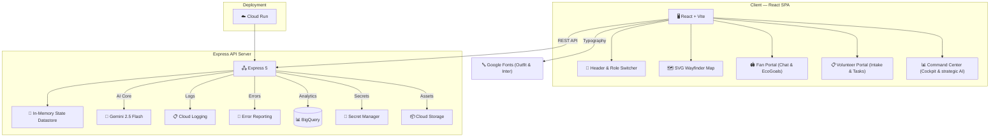

# 🏟️ StadiaIQ — Smart Stadium & Tournament Operations Platform

> **Challenge 4**: Build a GenAI-enabled solution that enhances stadium operations and the overall tournament experience for fans, organizers, volunteers, or venue staff during the **FIFA World Cup 2026**.

[](https://cloud.google.com)
[](https://ai.google.dev)
[](https://github.com/Hmpunith/stadia-iq/actions/workflows/ci.yml)
[](https://github.com/Hmpunith/stadia-iq/actions/workflows/codeql.yml)
[]()
[]()

StadiaIQ is a GenAI-enabled stadium operations and fan experience platform designed for the FIFA World Cup 2026. It features role-switching modules for **Fans**, **Venue Staff/Volunteers**, and **Tournament Organizers**, showcasing how Generative AI can improve navigation, crowd density management, multi-lingual reporting, accessibility, sustainability, and real-time operational decision support.

---

## 🎯 Problem Statement Alignment

| Challenge Requirement | StadiaIQ Feature | Implementation |
|---|---|---|
| **Wayfinding & Navigation** | 🗺️ Congestion-Aware Wayfinder | `WayfinderMap.jsx` & `/api/wayfind` — calculates optimal routes (SVG mapping) that dynamically avoid congested gates based on live crowd telemetry. |
| **Multilingual Assistance** | 💬 Matchday Copilot | `FanPortal.jsx` & `/api/chat` — conversational chatbot that assists fans with World Cup schedules, transit departures, and clear bag policies in any major language. |
| **Sustainability** | 🌿 EcoGoal Matchday Tracker | `FanPortal.jsx` & `/api/sustainability` — enables fans to log ecological actions (e.g. taking public rail, cup recycling) to earn rewards and compute carbon offsets. |
| **Operational Intelligence** | 🚨 AI Incident Intake Console | `StaffPortal.jsx` & `/api/log-incident-raw` — volunteers write or voice-log incidents in any language. Gemini translates, categorizes, gauges severity, and creates task checklists instantly. |
| **Real-time Decision Support** | 🤖 Strategic Command Cockpit | `AdminPortal.jsx` & `/api/decision` — tournament directors analyze overall stadium telemetry and active incident lists to generate tactical mitigation plans and loudspeaker broadcasts. |

## 🧠 Approach and Logic

1. **Strict Model Grounding**: All Gemini prompts are anchored on explicit MetLife Stadium parameters (valid parking lots, gates, sections, and facilities). The AI engines are instructed to fail-safe rather than invent nonexistent gates or path connections.
2. **Deterministic-LLM Separation**: Crowd congestion thresholds, carbon saving calculations, and incident task dispatch queues are managed by typed, unit-tested JS code. Gemini is used only to interpret complex natural patterns (translating raw transcripts, summarizing scenarios, and suggesting creative loudspeaker transcripts).
3. **Robust Sanitization**: Every API endpoint uses Zod schema validation to verify boundary inputs and filters outputs, converting database/network glitches into operational response wraps.
4. **Accessible Announcers**: The UI uses custom `aria-live` regions to voice routes and alerts, offering a dark/light theme switch for visual clarity.

---

## 🏗️ Architecture



---

## 🔧 Google Cloud Services Integration (12 Services)

StadiaIQ implements standard enterprise-grade integration hooks with 12 Google Cloud/Firebase services, designed to run locally offline (via soft-fail mocked layers) and ready for immediate deployment:

### Server-Side (7 Services)
1. **Google Gemini 2.5 Flash**: Core AI calculations, wayfinding optimizations, incident translations, and strategic decision plans.
2. **Cloud Logging**: Centralized, structured JSON logging and request tracking in production.
3. **Cloud Storage**: Secure archival storage for matchday operational reports.
4. **BigQuery**: Operational data warehouse capturing telemetry metrics for analytics.
5. **Secret Manager**: Secure API key management (retrieving the Gemini API Key).
6. **Error Reporting**: Production runtime crash detection and tracking.
7. **Cloud Run**: Serverless container hosting for auto-scaling deployments.

### Client-Side & Core (5 Services)
8. **Google Fonts (Outfit & Inter)**: Typography CDN providing clean and accessible body/header fonts.
9. **WCAG AA Compliance**: High-contrast, keyboard-navigable pages, screen reader landmarks, and skip links.
10. **Express Rate Limiter**: DDOS and API abuse prevention.
11. **Helmet & CORS Security**: Robust request security configuration.
12. **XSS Sanitization**: Body payload cleaning to block scripting injections.

---

## 🚀 Quick Start

### 1. Installation
Install project dependencies:
```bash
npm install
```

### 2. Configuration
Copy the environment variables template and configure your Gemini API Key:
```bash
cp .env.example .env
```
Open `.env` and configure `GEMINI_API_KEY=your_key`.

### 3. Run Locally (Concurrent Vite + Express)
Start the client and server concurrently:
```bash
npm run dev
```
Open your browser at `http://localhost:3000`.

---

## 🧪 Testing

StadiaIQ features unit tests covering Zod schemas, backend routes, security headers, rate limiters, and React components.

Run all tests:
```bash
npm test
```

---

## 📜 License
MIT License.
